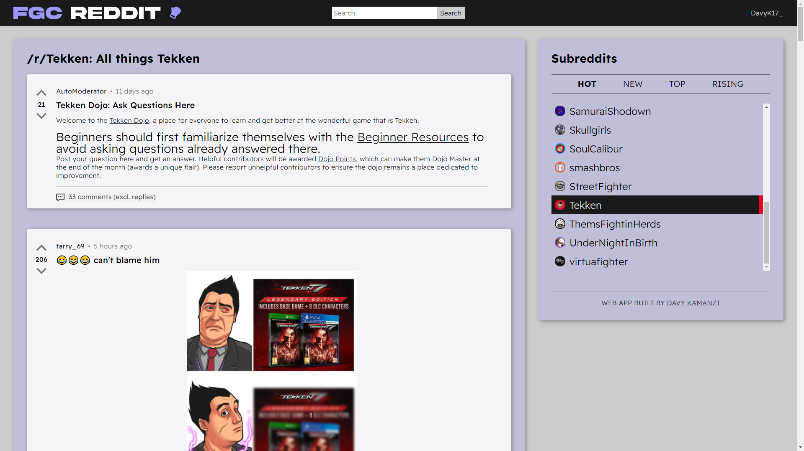

# FGC Reddit

This is a portfolio project I did as part of my full stack engineer course on [Codecademy](https://codecademy.com). It is a React-Redux app that allows the user to view [Reddit](https://reddit.com) posts from various fighting game community (FGC)-related subreddits. The app requires authentication with the user's Reddit account to be used, and does not display posts containing galleries, links, or embeds.

## The project
### Requirements
- Build the application using React and Redux
- Version control your application with Git and host the repository on GitHub
- Use a project management tool (GitHub Projects, Trello, etc.) to plan your work
- Write a README (using Markdown) that documents your project including:
- Write unit tests for your components using Jest and Enzyme
- Write end-to-end tests for your application
- Users can use the application on any device (desktop to mobile)
- Users can use the application on any modern browser
- Users can access your application at a URL
- Users see an initial view of the data when first visiting the app
- Users can search the data using terms
- Users can filter the data based on categories that are predefined
- Users are shown a detail view (modal or new page/route) when they select an item
- Users are delighted with a cohesive design system
- Users are delighted with animations and transitions
- Users are able to leave an error state
- Get 90+ scores on Lighthouse

## How it was built
### Base libraries/techonolgies
- [React](https://reactjs.org/) - JavaScript library
- [Redux](https://redux.js.org/) - State management tool
- [React-Redux](https://react-redux.js.org/) - React bindings for Redux
- [Redux Toolkit](https://redux-toolkit.js.org/) - Redux development utility library
- [Jest](https://jestjs.io/) - JavaScript testing framework
- [React Testing Library](https://testing-library.com/docs/react-testing-library/intro/) - React testing utility

### Additional libraries/techonolgies
- [jQuery](https://jquery.com/) - JavaScript DOM manipulation library
- [React Loading Skeleton](https://www.npmjs.com/package/react-loading-skeleton) - Animated loading skeleton tool
- [Moment.js](https://momentjs.com/) - JavaScript time manipulation library

## Features
FGC Reddit is a single page app (SPA) with a simple design that is accessible from desktop, tablet and mobile devices with all modern browsers, with Lighthouse scores of 98 for performance, 100 for accessibility, 93 for best practices, and 100 for SEO (full report can be viewed by [clicking here](./src/lighthouse.pdf)).

Once authentication with Reddit is fulfilled, the user is able to pick from 22 predefined subreddits related to the fighting game community (FGC), including the /r/Fighters subreddit and those covering the following games/franchises:
- Blazblue
- Brawlhalla
- Dead or Alive
- Dragon Ball FighterZ
- Guilty Gear
- Injustice
- Killer Instinct
- The King of Fighters (KOF)
- Marvel vs. Capcom
- Melty Blood
- Mortal Kombat
- "Project L"
- Samurai Shodown
- Skullgirls
- SoulCalibur
- Super Smash Bros.
- Street Fighter
- Tekken
- Them's Fightin' Herds
- Under Night In-Birth (UNI)
- Virtua Fighter

Aside from viewing displayed content, users are also able to view all top-level comments for each post (excluding replies), as well as filter posts by Reddit's listing options (Hot [by default], New, Top, or Rising), and upvote, downvote, or unvote on each post. Users may also use the search box to filter through the rendered posts.

## Screenshots
### Desktop version

### Mobile version

# Author
- GitHub: [@DavyK17](https://github.com/DavyK17)
- Website: [davyk17.github.io](https://davyk17.github.io)